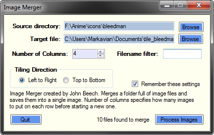

Tile Merger
===========

The tile merger is a GUI application that takes a folder full of image files and mergers them into a single tiled image. Use the columns field to set the number of tiles per row. The image size is automatically calculated based on the source images. Images are sorted by their filename. I suggest using a numeric prefix naming scheme such as "001 tree.png", "002 table.png", "003 chair.png" etc. in order to predictably position images.

Latest Release
--------------
Download [TileMerger_rel_c1.zip](https://cdn.rawgit.com/Markavian/tile-merger/bb84593c5712c202e2c602a40f13bf8234361b4b/c-sharp/releases/TileMerger_rel_c1.zip) (34Kb)
* **Requires .NET 2.0 to run**

### Installation
* Open and extract the files from the zip
* Run `TileMerger.exe`

Version history
---------------

### Release c1 
* Added Tiling Direction - Left to Right (Original Mode), Top to Bottom (New)
* Switch between (Number of Columns) and (Number of Rows)

### Release b1
* Added filter text box
* Added a tooltips to number of columns and filter boxes
* Asks for file target if Not set
* Added process label to display number of files processed
* Fixed series of crashing bugs
* Filters out non-image files when processed

### Release a1
* Initial release
* Supports:
  * Source folder
  * Target file
  * Number of columns
  * Remember settings
* Supports alpha channels. Tested on Windows XP.

Credits
-------
Written by John Beech
* http://mkv25.net/

Used on:
* http://mkv25.net/dfma/

Contact
-------
* csharp@mkv25.net
* github@mkv25.net

Please create an issue or send feedback here on github!

### Available at:
* https://github.com/Markavian/tile-merger

### Older versions:
* http://mkv25.net/showcase/

