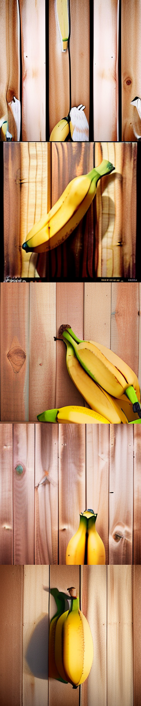
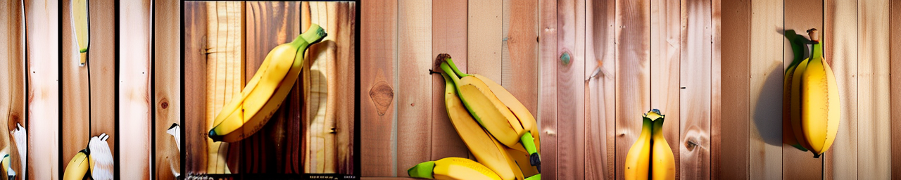
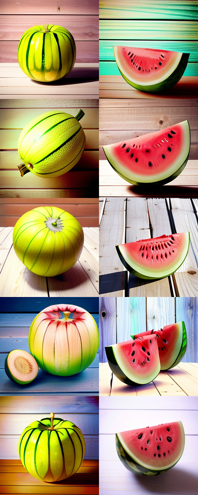
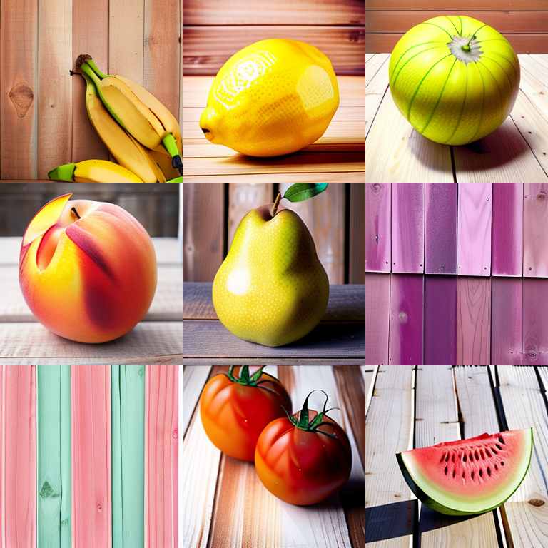
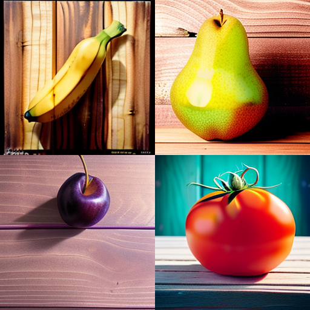

Tile Merger
===========

The tile merger is a GUI or CLI application that takes a folder full of image files and mergers them into a single tiled image. Use the columns field to set the number of tiles per row. The image size is automatically calculated based on the source images. Images are sorted by their filename. I suggest using a numeric prefix naming scheme such as "001 tree.png", "002 table.png", "003 chair.png" etc. in order to predictably position images.

Latest Release
--------------
Download [TileMerger_1.1.0.zip](./releases/TileMerger_1.1.0.zip) (39Kb)

* **Requires .NET 2.0 to run**

### Installation
* Open and extract the files from the zip
* Run `TileMerger.exe`

### How to use


* **Source directory** - browse to a folder full of images that you want to merge
* **Target file** - name the file you want to create after merging the images
* **Number of Rows / Columns** - the number of rows or columns to fill before wrapping - this changes depending on the **Tiling Direction**
* **Filename filter** - a pattern to match against, filtering only the files that match the filter. Leave blank for all files.
* **Tiling Direction** 
  * Left to Right - Fill a row from left to right before moving down
  * Top to Bottom - Fill a column from top to bottom before moving right
* **Remember these settings** - remembers all the settings in the form
* **Process Images** - Attempts to merge the supplied images and save to the `Target file` path
* **Quit** - Closes the application


### Command Line Mode

New as of version 1.0.0 (July 2023), you can use TilerMerger from the command line.

```
>TileMerger.exe --help
Tile Merger 1.0
Supported arguments:

--src="<path>"          Source folder to find files in
--imgs="f1.png,f2.png"  Comma separated list of files, overrides src, will still be filtered
--dest="<path>"         Destination file path to output to, defaults to ./TiledImages_x{cols}_{td|lr}.png
--filter="string"       Filter string, inclusive match
--cols=6                Number of columns before wrapping
--td=lr|tb              Tiling Direction
--help                  Show help and version info

Website: https://github.com/Markavian/tile-merger
```

## Example Commands

Examples using a dev build from the `./c-sharp/` folder:

### Merge all images containing the word banana across 1 columns, tiling top to bottom

```
TileMerger.exe --src="./sample-images/" --dest="sample-outputs/bananas_1x5.png" --filter="banana" --cols="1" --td="tb"
```



### Merge all images containing the word banana across 5 columns, tiling left to right

```
TileMerger.exe --src="./sample-images/" --dest="sample-outputs/bananas_5x1.png" --filter="banana" --cols="5" --td="lr"
```



### Merge all images containing the word melon (watermelon, and melon) across 2 columns, tiling top to bottom

```
TileMerger.exe --src="./sample-images/" --dest="sample-outputs/melons_2x5.png" --filter="melon" --cols="2" --td="tb"
```



### Merge all images containing the number 00003 across 3 columns, tiling left to right

```
TileMerger.exe --src="./sample-images/" --dest="sample-outputs/mixed_3x3.png" --filter="00003" --cols="3" --td="lr"
```



### Merge all images across 5 columns, tiling left to right

```
.\bin\Release\TileMerger.exe --src="./sample-images/" --dest="sample-outputs/mixed_5x9.png" --cols="5" --td="lr"
```


### Merge a list of four specific images across 2 columns

```
.\bin\Release\TileMerger.exe --imgs="./sample-images/banana_00002_.png,./sample-images/pear_00001_.png,./sample-images/plum_00001_.png,./sample-images/tomato_00001_.png" --dest="sample-outputs/mixed_2x2.png" --cols="2"
```



Version history
---------------

### Release 1.0.0 (July 2023)

- Added command line arguments
- Fully migrated to Github
- Fixed bug with tiling direction to work as intended


```
Tile Merger 1.0
Supported arguments:

--src="<path>"            Source folder to find files in; also used as base directory to find relative imgs
--imgs="f1.png,f2.png"    Comma separated list of files, works in tandem with src; file list will still be filtered
--dest="<path>"           Destination file path to output to, defaults to ./ TiledImages_x{ cols}_{ td | lr}.png
--filter="string"         Filter string, inclusive match
--cols=6                  Number of columns before wrapping
--td=lr|tb                Tiling Direction - left-right (lr) or (top-bottom) (tb)
--help                    Show help and version info
```

### Release c1 (November 2008)
* Added Tiling Direction - Left to Right (Original Mode), Top to Bottom (New)
* Switch between (Number of Columns) and (Number of Rows)

### Release b1 (August 2008)
* Added filter text box
* Added a tooltips to number of columns and filter boxes
* Asks for file target if Not set
* Added process label to display number of files processed
* Fixed series of crashing bugs
* Filters out non-image files when processed

### Release a1 (2008)
* Initial release
* Supports:
  * Source folder
  * Target file
  * Number of columns
  * Remember settings
* Supports alpha channels. Tested on Windows XP.

Credits
-------
Written by John Beech
* https://mkv25.net/
* https://github.com/johnbeech/

With contributions and thanks to XtheOne:
- https://github.com/XtheOne

Used on:
* https://mkv25.net/dfma/

Contact
-------
* csharp@mkv25.net
* github@mkv25.net

Please create an issue or send feedback here on github!

### Available at:
* https://github.com/Markavian/tile-merger

### Older versions:
* https://mkv25.net/showcase/


